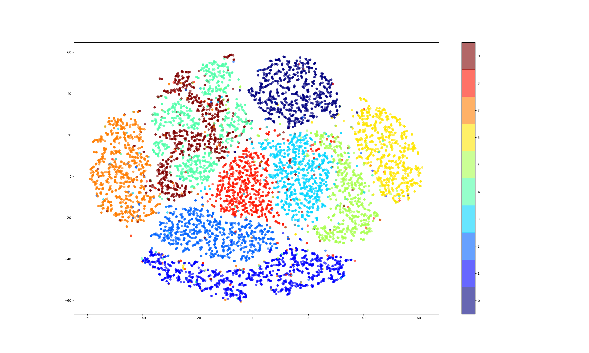
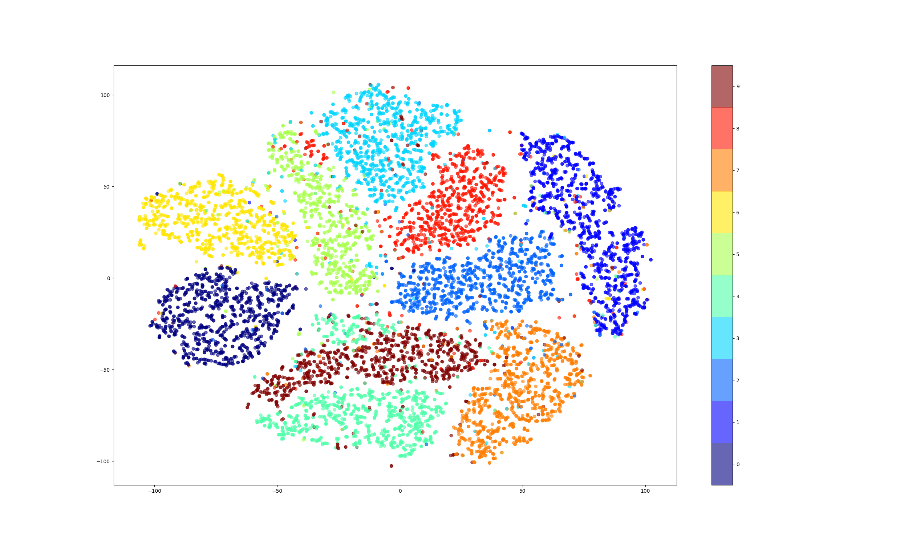
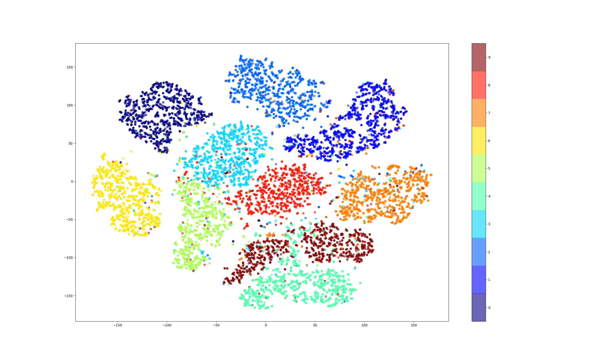

### t-SNE MNIST

Данные качал при помощи `sklearn.datasets.fetch_mldata`. Визуализирова только рандомные 10000 элементов из выборки, в угоду скорости. Далее осуществлял перебор параметров: `perplexity` 10, 30, 50, количество итераций 250, 500, 1000, 3000. `learning_rate(epsion)` не перебирал, использовал 500, как в примере на сайте [t-SNE](https://lvdmaaten.github.io/tsne/).

Как понятно из графиков [p=10 iterations=250](./plots/p=10_iterations=250.png), [p=30 iterations=250](./plots/p=30_iterations=250.png), [p=50 iterations=250](./plots/p=50_iterations=250.png) 250 итераций довольно мало. Притом не важно какое perplexity. Не зря это минимальное значение для t-SNE.

Далее рассмотрим каждое значение perplexity отдельно:

#### p=10

При 500 итерациях  уже можно придумать какие-то зависимости. Например `4` и `9` смешались, что можно объяснить тем, что цифры часто похожи. Но больше никаких зависимостей на этой картинке я не увидел.

Здесь:  близость `4` и `9` остается, но теперь все кластеры выделились более явно.

При 3000 итераций:  все то же самое, только классы разделились ещё сильнее. 

Из интересного, что объяснить не смог: кластеры перемещаются относительно друг друга в зависимости от количества итераций. Интересно было бы помотреть на это передвижение.
